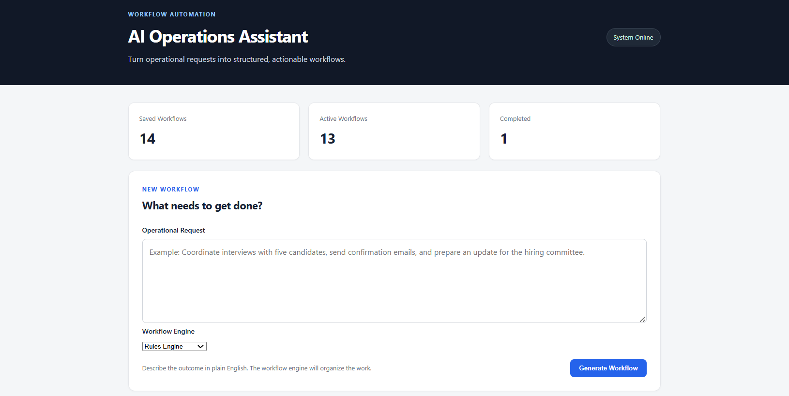
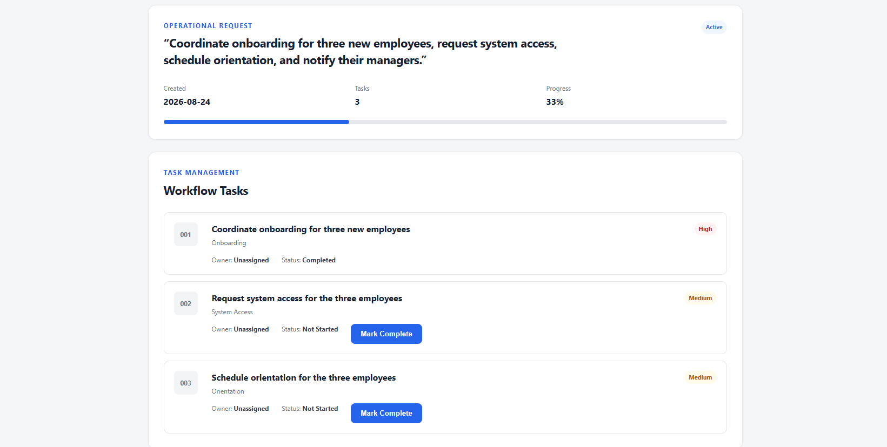

# AI Operations Assistant

A Python and Flask workflow application that transforms plain-English operational requests into structured, prioritized, and trackable workflows.

The application supports both a deterministic **Rules Engine** and a locally hosted **AI Engine powered by Qwen through Ollama**, allowing users to generate workflows without relying on a paid cloud AI API.

## Overview

Operational requests often begin as unstructured instructions: coordinate onboarding, schedule interviews, prepare communications, track candidates, or organize administrative work.

AI Operations Assistant converts those requests into actionable workflows with:

- Individual tasks
- Task categories
- High, Medium, and Low priorities
- Task status tracking
- Workflow progress
- Recommended next actions
- Persistent workflow storage

Users can create and manage workflows through a Flask-based web dashboard.

## Application Preview

### Workflow Dashboard



The dashboard provides workflow creation, engine selection, workflow metrics, progress tracking, and access to saved workflows.

### AI-Generated Workflow



Local AI converts an operational request into structured tasks with categories, relative priorities, and trackable statuses.

## Workflow Engines

### Rules Engine

The deterministic engine analyzes keywords in an operational request and generates predefined tasks.

This provides predictable workflow generation and does not require an AI model.

### Local AI Engine

The AI engine sends the operational request to **Qwen3 1.7B running locally through Ollama**.

The model decomposes the request into 2–6 actionable tasks and assigns each a category and relative priority. Python then validates the model output and converts it into the application's standardized task structure.

Because inference runs locally, workflow requests do not require a paid AI API.

## Key Features

- Natural-language operational request input
- Dual workflow engines: Rules and Local AI
- Local Qwen integration through Ollama
- Structured AI output validation
- High / Medium / Low task prioritization
- Task lifecycle management
- Not Started → In Progress → Completed states
- Automatic workflow progress calculation
- Recommended next-action selection
- JSON workflow persistence
- Flask web dashboard
- Loading state during local AI generation
- Graceful handling of invalid or unavailable AI responses
- Automated unit and web application testing

## Example

Input:

> Coordinate onboarding for three new employees, request system access, schedule orientation, and notify their managers.

Example Local AI output:

| Task | Category | Priority |
| --- | --- | --- |
| Coordinate onboarding for three new employees | Onboarding | High |
| Request system access for the three employees | System Access | Medium |
| Schedule orientation for the three employees | Orientation | Medium |
| Notify managers about onboarding activities | Communication | Low / Medium |

The generated tasks can then be started, completed, and tracked through the web interface.

## Architecture

```text
User
  |
  v
Flask Web Interface
  |
  v
Workflow Engine Selector
  |
  +-------------------+
  |                   |
  v                   v
Rules Engine       Local AI Engine
                       |
                       v
                    Ollama
                       |
                       v
                  Qwen3 1.7B
  |                   |
  +---------+---------+
            |
            v
      Python Validation
            |
            v
    Standardized Tasks
            |
            v
      JSON Persistence
            |
            v
   Workflow Dashboard
```

The AI model is responsible for interpreting and decomposing the operational request. Python remains responsible for validation, application state, task IDs, ownership defaults, status management, and persistence.

## Technology Stack

- **Python 3.13**
- **Flask 3.1**
- **Ollama Python Client**
- **Qwen3 1.7B**
- **HTML / CSS**
- **Jinja**
- **JSON**
- **unittest**
- **Git / GitHub**

## Installation

### 1. Clone the repository

```bash
git clone https://github.com/dbridgelall/ai-operations-assistant.git
cd ai-operations-assistant
```

### 2. Create a virtual environment

Windows:

```powershell
python -m venv .venv
.venv\Scripts\Activate.ps1
```

macOS / Linux:

```bash
python3 -m venv .venv
source .venv/bin/activate
```

### 3. Install Python dependencies

```bash
pip install -r requirements.txt
```

The project currently uses:

```text
Flask==3.1.3
ollama==0.6.2
```

## Local AI Setup

The Rules Engine works without Ollama.

To use the Local AI engine, install Ollama and download the Qwen model.

After installing Ollama:

```bash
ollama pull qwen3:1.7b
```

Verify that the model is available:

```bash
ollama list
```

The application communicates with the locally running model through the Ollama Python client.

## Running the Web Application

Start the Flask application:

```bash
python web_app.py
```

Then open the local address displayed by Flask, typically:

```text
http://127.0.0.1:5000
```

From the dashboard:

1. Enter an operational request.
2. Select **Rules Engine** or **Local AI — Qwen**.
3. Generate the workflow.
4. Open the generated workflow.
5. Start and complete tasks.
6. Track progress from the dashboard.

Local AI generation may take longer on systems running the model entirely on CPU.

## Testing

Run the automated test suite with:

```bash
python -m unittest
```

The test suite covers workflow generation, task creation, prioritization, workflow progress, persistence behavior, Flask routes, task status updates, AI integration through mocking, malformed AI responses, task-count validation, engine selection, and graceful AI failure handling.

AI calls are mocked during automated testing so the test suite does not require the local model to perform inference.

## Local AI Reliability

AI-generated data is treated as untrusted input.

The application validates model responses before creating a workflow. Invalid JSON, malformed responses, and invalid task counts are rejected through controlled error handling.

If Local AI cannot generate a valid workflow, the web interface displays an error instead of saving a broken workflow.

## Project Structure

```text
ai-operations-assistant/
├── app.py
├── web_app.py
├── storage.py
├── requirements.txt
├── README.md
├── templates/
│   ├── index.html
│   └── workflow.html
├── static/
│   └── style.css
├── test_app.py
├── test_storage.py
└── test_web_app.py
```

The exact repository structure may evolve as the project is expanded.

## Design Principles

This project intentionally separates:

- Workflow interpretation
- Application logic
- Storage
- Web presentation
- AI inference

The Rules Engine provides deterministic behavior while the Local AI engine demonstrates how an AI model can be incorporated without giving it direct control over application state.

## Future Enhancements

Potential future improvements include:

- Database-backed persistence
- Workflow editing
- Task ownership and assignment
- Additional local model options
- Configurable workflow templates
- Export and reporting tools
- Asynchronous AI generation
- Expanded integration testing

## Project Status

The core workflow application, Flask interface, Rules Engine, Local AI integration, workflow persistence, task lifecycle management, progress tracking, AI validation, and automated testing are implemented.

Current work is focused on documentation, usability, and portfolio presentation.
